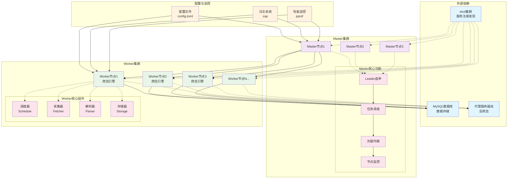
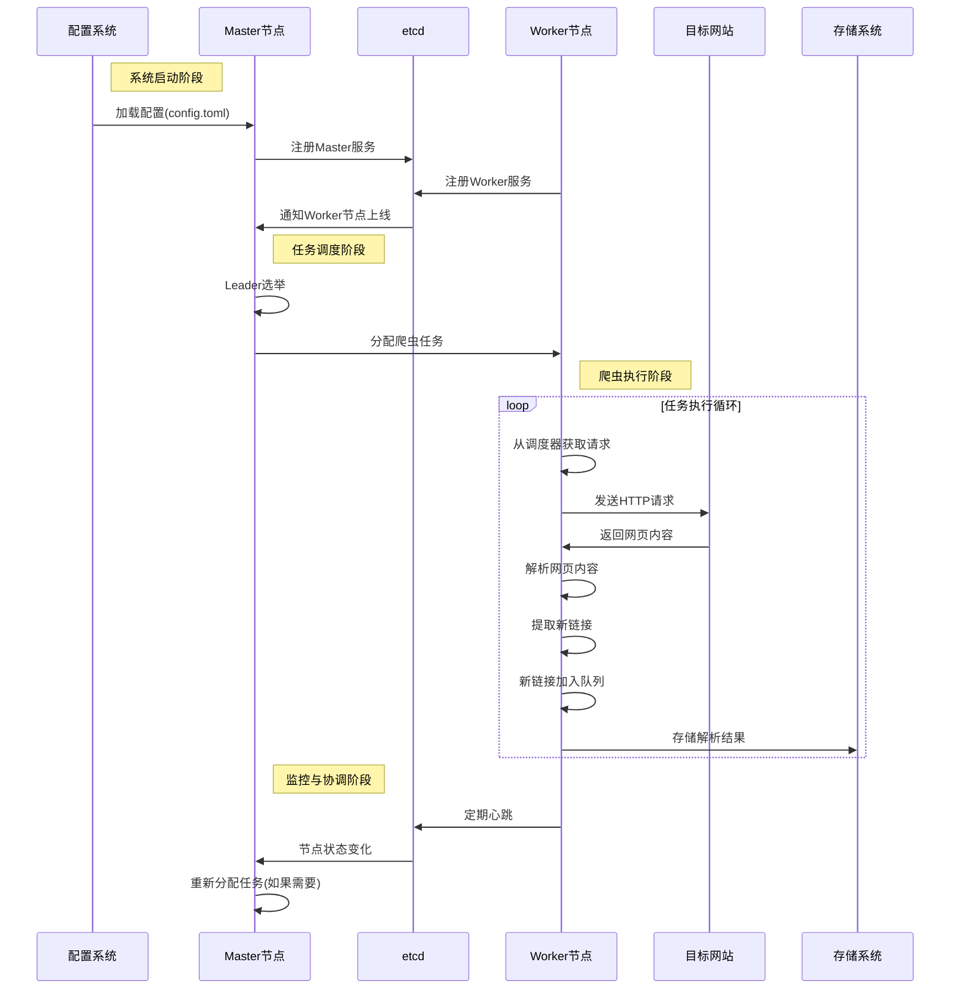
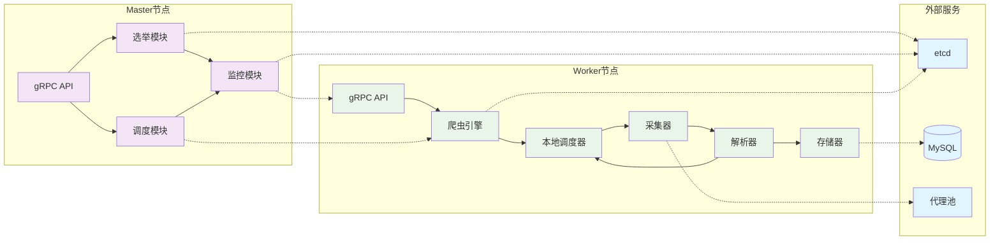
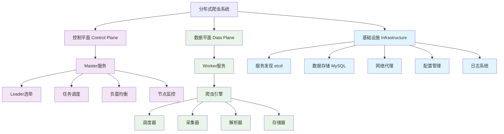

# 分布式爬虫系统架构图

## 系统架构概览

## 数据流程图

## 组件交互图

## 核心模块层次图

## 关键特性说明

### 🎯 高可用设计
- **多Master选举**：通过etcd实现自动Leader选举
- **故障转移**：Leader失效时自动切换
- **服务发现**：实时监控Worker节点状态

### ⚡ 性能优化
- **并发控制**：可配置的Worker数量
- **限流机制**：令牌桶算法控制请求频率
- **代理轮询**：多代理IP避免被封

### 🔧 扩展性设计
- **插件架构**：支持自定义Fetcher、Parser、Storage
- **动态配置**：热加载配置变更
- **水平扩展**：Worker节点可无限扩展

### 🛡️ 容错机制
- **错误重试**：失败请求自动重试
- **panic恢复**：Worker异常自动恢复
- **状态同步**：通过etcd保证状态一致性

这些架构图从不同角度展示了系统的设计，帮助你更好地理解各个组件之间的关系和协作方式。