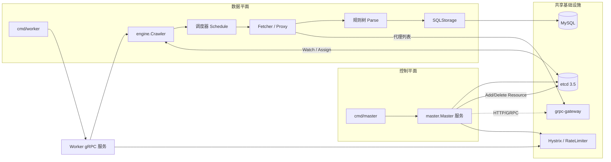

# 分布式架构总览

## 项目使命
- **目标**：构建可横向扩展的分布式爬虫平台，支持多站点抓取、可配置限速，以及数据落地持久化。
- **运行模式**：通过 `crawler master` 与 `crawler worker` 两条指令分别启动控制平面与数据平面的微服务，二者以 etcd 作为协调中心，借助 go-micro 提供 RPC 与服务注册能力。
- **核心优势**：任务描述语言化（`spider.Task` + 规则树）、组件解耦（抓取、解析、存储）、以及可插拔的限速与代理策略。

## 顶层组件视图

- **Master 服务（控制平面）**：`cmd/master` → `master.Master`。负责全局任务资源表的增删改查、工作节点的注册发现、以及任务与节点之间的调度分配。
- **Worker 服务（数据平面）**：`cmd/worker` → `engine.Crawler`。负责加载配置中的任务、执行抓取与解析、并将结果写入存储。
- **共享基础设施**：
  - **etcd 3.5**：存放 `/resources` 下的任务编排信息，同时承载 worker/master 的租约心跳。
  - **MySQL**：通过 `storage/sqlstorage` 落地结构化数据；任务名即表名。
  - **go-micro + gRPC/Gateway**：提供服务注册、熔断、限流包装，以及 HTTP↔gRPC 互通。

## 控制平面：Master 服务
- **入口**：`cmd/master/master.go` 的 `Run()`。
- **启动流程**：
  1. 读取 `config.toml` 配置，初始化 zap 日志与 etcd 注册中心。
  2. 解析 `Tasks` 配置、通过 worker 的 `ParseTaskConfig` 构造初始种子。
  3. 建立 go-micro gRPC 服务 `go.micro.server.master`，注册 `proto.CrawlerMaster` RPC 与 HTTP Gateway。
  4. 周期性向 etcd 注册自身信息；通过 Hystrix 包装下游调用、RateLimiter 控制入口 QPS。
- **职责要点**：
  - **资源管理**：`master.Master.addResources` 将任务写入 etcd `/resources/<task>`，并带上调度到的 worker 节点 ID。
  - **Leader 选举**：利用 etcd session + 选主锁，保证只有 leader 负责分配资源；非 leader 会将 RPC 请求转发给现任 leader。
  - **故障恢复**：监听工作节点租约变化并触发 `reAssign()`，将任务重新分配到存活节点；删除资源时回收节点负载计数。
- **对外接口**：
  - `AddResource` / `DeleteResource` RPC，同时暴露 RESTful `/crawler/resource` 以便控制面板或运维脚本调用。

## 数据平面：Worker + Engine
- **入口**：`cmd/worker/worker.go` 的 `Run()`。
- **启动流程**：
  1. 初始化 zap 日志、加载代理与 Fetcher（`collect.BrowserFetch`）。
  2. 构建存储层（`sqlstorage.New`），并读取 `Tasks` 配置生成种子任务。
  3. 以 `engine.NewEngine` 构建核心爬虫实例，注入 Fetcher、Storage、调度器与 etcd Registry 地址。
  4. 注册自身为 go-micro gRPC 服务 `go.micro.server.worker`；根据配置决定是否以集群模式运行。
- **执行管线**：
  1. **种子调度**：在非集群模式下，`handleSeeds` 直接将配置种子推入 Scheduler；集群模式依赖 master 下发任务。
  2. **Scheduler**：`engine.Schedule` 同时维护普通队列与优先队列，保证高优先级任务优先出队，并在推送前执行 `Request.Check()`。
  3. **Worker 协程**：`CreateWork` 持续拉取请求，执行 Fetch → Parse → Item 数据化 → Storage.Save。
  4. **失败处理**：`SetFailure` 将失败请求放回队列一次重试，并在 `failures` 映射中记录，避免重复冲突。
  5. **结果通道**：解析结果经 `HandleResult` 汇总，触发数据持久化；`Store.Hash` 维护任务~规则映射，支撑字段推断。
- **集群协作**：
  - Worker 监听 `/resources` 前缀，`watchResource` 收到新增时执行 `runTasks`，关闭事件触发 `deleteTasks`。
  - Worker 在 etcd 中保留 `id|address` 形式的租约键，供 master 做负载均衡与节点剔除。

## 任务与解析模型
- **Task**：由 `spider.Task` 定义，包含任务名、最大深度、限速器、Fetcher、Storage、Cookie 等属性。
- **规则树 (RuleTree)**：
  - `Rule.Root`：返回初始请求列表（可由 Go 代码或 JS 脚本组成）。
  - `Rule.Trunk`：针对不同规则名定义 `Parse`、`AidFunc`、`ItemFields` 等核心逻辑。
- **Request / Context**：`spider.Request` 描述抓取 URL、方法、优先级；`Context` 为解析阶段提供 `AddItem`、`AddQueue` 等 API。
- **ParseResult / DataCell**：解析输出结构体，最终交由 `sqlstorage` 以批量方式 Flush 到 MySQL。
- **JavaScript 规则**：`engine.Store.AddJSTask` 借助 Otto 引擎运行动态脚本，支持在运行期下发新任务。

## 速率限制、代理与扩展点
- **限速**：`limiter.Multi` 组合多个 `rate.Limiter`，可在 `config.toml` 为任务设置不同的 `[Tasks].Limits`。
- **代理池**：`proxy.RoundRobinProxySwitcher` 轮询代理列表，配合 Fetcher 在请求前注入随机 UA 与代理。
- **存储扩展**：`spider.Storage` 接口允许替换为 Kafka、ES 等实现，当前默认实现为 `SQLStorage`。
- **日志与监控**：统一使用 `log` 包封装 zap 日志，服务默认开启 `net/http/pprof` 暴露在 `--pprof` 端口。

## 配置与运行命令
- **配置文件**：`config.toml` 控制任务、抓取参数、存储、Master/Worker 的 go-micro 设置。
- **快速启动**：
  - `docker-compose up`（准备 etcd + MySQL）。
  - `go run . master --config config.toml`
  - `go run . worker --config config.toml`
- **开发工具链**：`make build`、`make lint`、`make cover` 及 `make debug`。

## 深入阅读建议
- **源码纵深**：
  1. `master/master.go`：掌握 Leader 选举、资源分配、故障恢复细节。
  2. `engine/schedule.go`：逐步追踪 `Run → Schedule → CreateWork → HandleResult` 的执行链。
  3. `spider` 包：理解规则树与数据结构约束。
  4. `storage/sqlstorage` 与 `sqldb`：熟悉 SQL 动态建表与批量写入策略。
- **配套文档**：`docs/familiarization_plan.md`, `docs/reading_guide.md`, `docs/new_task_minimal.md`。
- **实践练习**：复现 `example_baidu_home`，随后尝试新增一个 Task 并通过 Master 控制启停，以验证对调度链路的理解。
