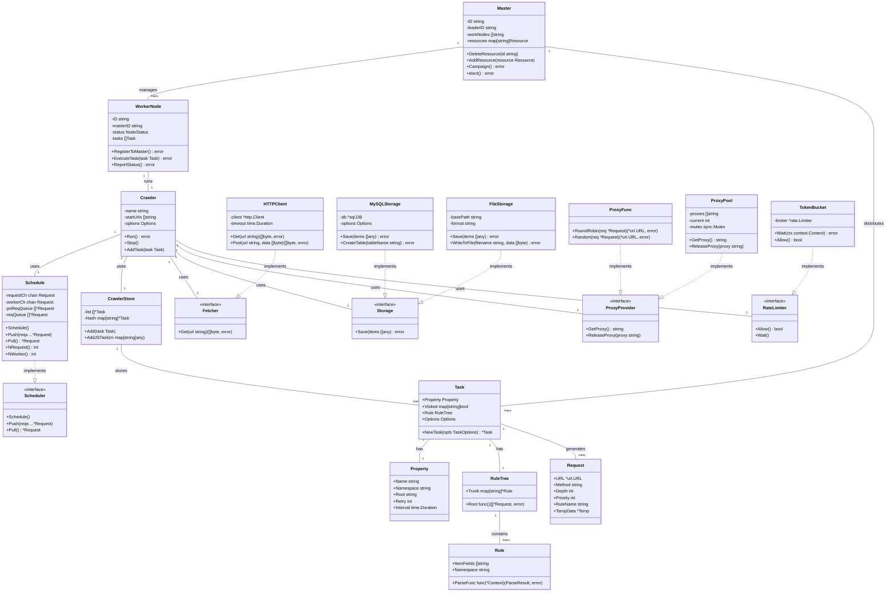

# 分布式爬虫系统 - 类图

## 类图说明

### 主控模块
- **Master**: 主控节点，负责任务分发和集群管理
- **WorkerNode**: 工作节点，执行具体的爬虫任务

### 爬虫引擎
- **Crawler**: 爬虫核心引擎，协调各个组件
- **Schedule**: 任务调度器，管理请求队列
- **CrawlerStore**: 任务存储器，缓存爬虫任务

### 爬虫任务
- **Task**: 爬虫任务实体，包含配置和规则
- **Property**: 任务属性配置
- **Request**: HTTP请求对象
- **RuleTree**: 解析规则树
- **Rule**: 具体的解析规则

### 网络模块
- **Fetcher**: 网络请求接口
- **HTTPClient**: HTTP客户端实现

### 存储模块
- **Storage**: 存储接口
- **MySQLStorage**: MySQL存储实现
- **FileStorage**: 文件存储实现

### 代理模块
- **ProxyProvider**: 代理提供者接口
- **ProxyFunc**: 代理函数实现
- **ProxyPool**: 代理池实现

### 限流模块
- **RateLimiter**: 限流器接口
- **TokenBucket**: 令牌桶限流实现