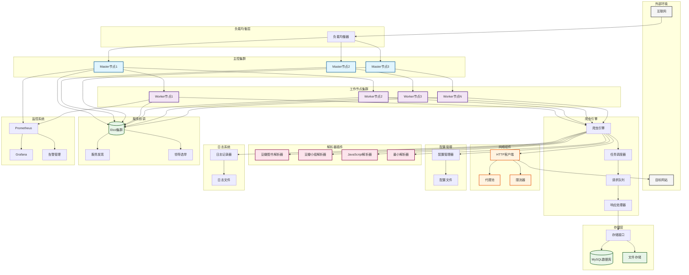

# 分布式爬虫系统 - 组件图

## 组件图说明

### 外部环境
- **互联网**: 系统运行的网络环境
- **目标网站**: 需要爬取的目标站点

### 负载均衡层
- **负载均衡器**: 分发请求到不同的Master节点

### 主控集群
- **Master节点**: 主控节点集群，负责任务分发和集群管理
- 支持多节点部署，通过Etcd进行领导选举

### 工作节点集群
- **Worker节点**: 工作节点集群，执行具体的爬虫任务
- 可水平扩展，动态加入和退出集群

### 爬虫引擎
- **爬虫引擎**: 核心爬虫逻辑
- **任务调度器**: 管理任务的调度和分发
- **请求队列**: 缓存待处理的HTTP请求
- **响应处理器**: 处理HTTP响应和数据提取

### 解析器插件
- **豆瓣图书解析器**: 专门解析豆瓣图书页面
- **豆瓣小组解析器**: 专门解析豆瓣小组页面
- **JavaScript解析器**: 处理需要JS渲染的页面
- **最小解析器**: 基础解析器实现

### 存储层
- **MySQL数据库**: 结构化数据存储
- **文件存储**: 非结构化数据存储
- **存储接口**: 统一的存储抽象层

### 网络组件
- **HTTP客户端**: 发送HTTP请求
- **代理池**: 管理代理服务器
- **限流器**: 控制请求频率

### 配置管理
- **配置管理器**: 管理系统配置
- **配置文件**: 存储配置信息

### 日志系统
- **日志记录器**: 记录系统日志
- **日志文件**: 存储日志信息

### 服务协调
- **Etcd集群**: 分布式键值存储，用于服务发现和配置管理
- **服务发现**: 自动发现集群中的服务
- **领导选举**: Master节点的领导选举机制

### 监控系统
- **Prometheus**: 指标收集和存储
- **Grafana**: 监控数据可视化
- **告警管理**: 系统异常告警