# 分布式爬虫系统 - 部署图

```mermaid
graph TB
    %% 互联网层
    subgraph "互联网"
        Internet[互联网]
        CDN[CDN网络]
    end

    %% 负载均衡层
    subgraph "负载均衡层"
        ALB[应用负载均衡器]
        NLB[网络负载均衡器]
    end

    %% Kubernetes集群
    subgraph "Kubernetes集群"
        subgraph "Master节点"
            K8sMaster1[K8s Master 1]
            K8sMaster2[K8s Master 2]
            K8sMaster3[K8s Master 3]
        end

        subgraph "Worker节点"
            K8sWorker1[K8s Worker 1]
            K8sWorker2[K8s Worker 2]
            K8sWorker3[K8s Worker 3]
            K8sWorkerN[K8s Worker N]
        end

        subgraph "应用Pod"
            subgraph "Master Pod"
                MasterPod1[Crawler Master 1]
                MasterPod2[Crawler Master 2]
                MasterPod3[Crawler Master 3]
            end

            subgraph "Worker Pod"
                WorkerPod1[Crawler Worker 1]
                WorkerPod2[Crawler Worker 2]
                WorkerPod3[Crawler Worker 3]
                WorkerPodN[Crawler Worker N]
            end
        end

        subgraph "服务发现"
            K8sService[Kubernetes Service]
            Ingress[Ingress Controller]
        end

        subgraph "配置管理"
            ConfigMap[ConfigMap]
            Secret[Secret]
        end
    end

    %% Etcd集群
    subgraph "Etcd集群"
        Etcd1[(Etcd节点1)]
        Etcd2[(Etcd节点2)]
        Etcd3[(Etcd节点3)]
    end

    %% 数据存储层
    subgraph "数据存储层"
        subgraph "MySQL集群"
            MySQLMaster[(MySQL主库)]
            MySQLSlave1[(MySQL从库1)]
            MySQLSlave2[(MySQL从库2)]
        end

        subgraph "文件存储"
            NFS[NFS共享存储]
            S3[对象存储S3]
        end

        subgraph "缓存层"
            Redis1[(Redis主节点)]
            Redis2[(Redis从节点)]
        end
    end

    %% 监控系统
    subgraph "监控系统"
        subgraph "指标收集"
            Prometheus1[Prometheus 1]
            Prometheus2[Prometheus 2]
        end

        subgraph "可视化"
            Grafana[Grafana]
        end

        subgraph "告警"
            AlertManager[AlertManager]
            Webhook[告警Webhook]
        end
    end

    %% 日志系统
    subgraph "日志系统"
        subgraph "ELK Stack"
            Elasticsearch[(Elasticsearch)]
            Logstash[Logstash]
            Kibana[Kibana]
        end

        subgraph "日志收集"
            Filebeat[Filebeat]
            Fluentd[Fluentd]
        end
    end

    %% 网络安全
    subgraph "网络安全"
        Firewall[防火墙]
        VPN[VPN网关]
        WAF[Web应用防火墙]
    end

    %% 连接关系
    Internet --> CDN
    CDN --> WAF
    WAF --> ALB
    ALB --> NLB
    NLB --> Ingress

    Ingress --> K8sService
    K8sService --> MasterPod1
    K8sService --> MasterPod2
    K8sService --> MasterPod3

    MasterPod1 --> WorkerPod1
    MasterPod1 --> WorkerPod2
    MasterPod2 --> WorkerPod3
    MasterPod3 --> WorkerPodN

    %% Pod部署关系
    K8sWorker1 --> MasterPod1
    K8sWorker1 --> WorkerPod1
    K8sWorker2 --> MasterPod2
    K8sWorker2 --> WorkerPod2
    K8sWorker3 --> MasterPod3
    K8sWorker3 --> WorkerPod3
    K8sWorkerN --> WorkerPodN

    %% 配置管理
    ConfigMap --> MasterPod1
    ConfigMap --> MasterPod2
    ConfigMap --> MasterPod3
    ConfigMap --> WorkerPod1
    ConfigMap --> WorkerPod2
    ConfigMap --> WorkerPod3
    ConfigMap --> WorkerPodN

    Secret --> MasterPod1
    Secret --> MasterPod2
    Secret --> MasterPod3

    %% Etcd连接
    MasterPod1 --> Etcd1
    MasterPod2 --> Etcd2
    MasterPod3 --> Etcd3
    WorkerPod1 --> Etcd1
    WorkerPod2 --> Etcd2
    WorkerPod3 --> Etcd3
    WorkerPodN --> Etcd1

    %% 数据存储连接
    WorkerPod1 --> MySQLMaster
    WorkerPod2 --> MySQLSlave1
    WorkerPod3 --> MySQLSlave2
    WorkerPodN --> MySQLMaster

    MySQLMaster --> MySQLSlave1
    MySQLMaster --> MySQLSlave2

    WorkerPod1 --> Redis1
    WorkerPod2 --> Redis2
    WorkerPod3 --> Redis1
    WorkerPodN --> Redis2

    Redis1 --> Redis2

    WorkerPod1 --> NFS
    WorkerPod2 --> S3
    WorkerPod3 --> NFS
    WorkerPodN --> S3

    %% 监控连接
    MasterPod1 --> Prometheus1
    MasterPod2 --> Prometheus1
    MasterPod3 --> Prometheus2
    WorkerPod1 --> Prometheus1
    WorkerPod2 --> Prometheus1
    WorkerPod3 --> Prometheus2
    WorkerPodN --> Prometheus2

    Prometheus1 --> Grafana
    Prometheus2 --> Grafana
    Prometheus1 --> AlertManager
    Prometheus2 --> AlertManager
    AlertManager --> Webhook

    %% 日志连接
    MasterPod1 --> Filebeat
    MasterPod2 --> Filebeat
    MasterPod3 --> Filebeat
    WorkerPod1 --> Fluentd
    WorkerPod2 --> Fluentd
    WorkerPod3 --> Fluentd
    WorkerPodN --> Fluentd

    Filebeat --> Logstash
    Fluentd --> Logstash
    Logstash --> Elasticsearch
    Elasticsearch --> Kibana

    %% 网络安全
    Firewall --> ALB
    VPN --> K8sMaster1
    VPN --> K8sMaster2
    VPN --> K8sMaster3

    %% 样式定义
    classDef k8smaster fill:#e3f2fd,stroke:#0277bd,stroke-width:2px
    classDef k8sworker fill:#f3e5f5,stroke:#7b1fa2,stroke-width:2px
    classDef appmaster fill:#e8f5e8,stroke:#2e7d32,stroke-width:2px
    classDef appworker fill:#fff3e0,stroke:#f57c00,stroke-width:2px
    classDef storage fill:#fce4ec,stroke:#c2185b,stroke-width:2px
    classDef monitor fill:#f1f8e9,stroke:#558b2f,stroke-width:2px
    classDef security fill:#ffebee,stroke:#d32f2f,stroke-width:2px
    classDef network fill:#e0f2f1,stroke:#00695c,stroke-width:2px

    class K8sMaster1,K8sMaster2,K8sMaster3 k8smaster
    class K8sWorker1,K8sWorker2,K8sWorker3,K8sWorkerN k8sworker
    class MasterPod1,MasterPod2,MasterPod3 appmaster
    class WorkerPod1,WorkerPod2,WorkerPod3,WorkerPodN appworker
    class MySQLMaster,MySQLSlave1,MySQLSlave2,Redis1,Redis2,Etcd1,Etcd2,Etcd3,Elasticsearch storage
    class Prometheus1,Prometheus2,Grafana,AlertManager,Kibana monitor
    class Firewall,VPN,WAF security
    class ALB,NLB,CDN network
```

## 部署架构说明

### 网络层级
1. **互联网层**: 通过CDN加速和WAF防护
2. **负载均衡层**: 应用负载均衡器和网络负载均衡器
3. **安全层**: 防火墙、VPN网关和Web应用防火墙

### Kubernetes集群
- **Master节点**: 3个节点组成的高可用控制平面
- **Worker节点**: 可扩展的工作节点，运行应用Pod
- **应用Pod**: 
  - Master Pod: 运行爬虫主控逻辑
  - Worker Pod: 运行爬虫工作逻辑
- **服务发现**: Kubernetes Service和Ingress Controller
- **配置管理**: ConfigMap和Secret管理配置和密钥

### 服务协调
- **Etcd集群**: 3节点集群，提供分布式键值存储
- 用于服务发现、配置管理和领导选举

### 数据存储层
- **MySQL集群**: 主从复制架构，1主2从
- **缓存层**: Redis主从架构
- **文件存储**: NFS共享存储和S3对象存储

### 监控系统
- **Prometheus**: 双节点部署，收集系统指标
- **Grafana**: 监控数据可视化
- **AlertManager**: 告警管理和通知

### 日志系统
- **ELK Stack**: Elasticsearch、Logstash、Kibana
- **日志收集**: Filebeat和Fluentd收集应用日志

### 部署特点
1. **高可用**: 关键组件多节点部署
2. **可扩展**: Worker节点和Pod可水平扩展
3. **容错性**: 多层冗余和故障转移
4. **安全性**: 多层安全防护
5. **可观测**: 完整的监控和日志系统

### 资源规划
- **Master Pod**: CPU 2核，内存 4GB
- **Worker Pod**: CPU 4核，内存 8GB
- **MySQL**: CPU 8核，内存 16GB，存储 1TB SSD
- **Redis**: CPU 2核，内存 8GB
- **Etcd**: CPU 2核，内存 4GB，存储 100GB SSD