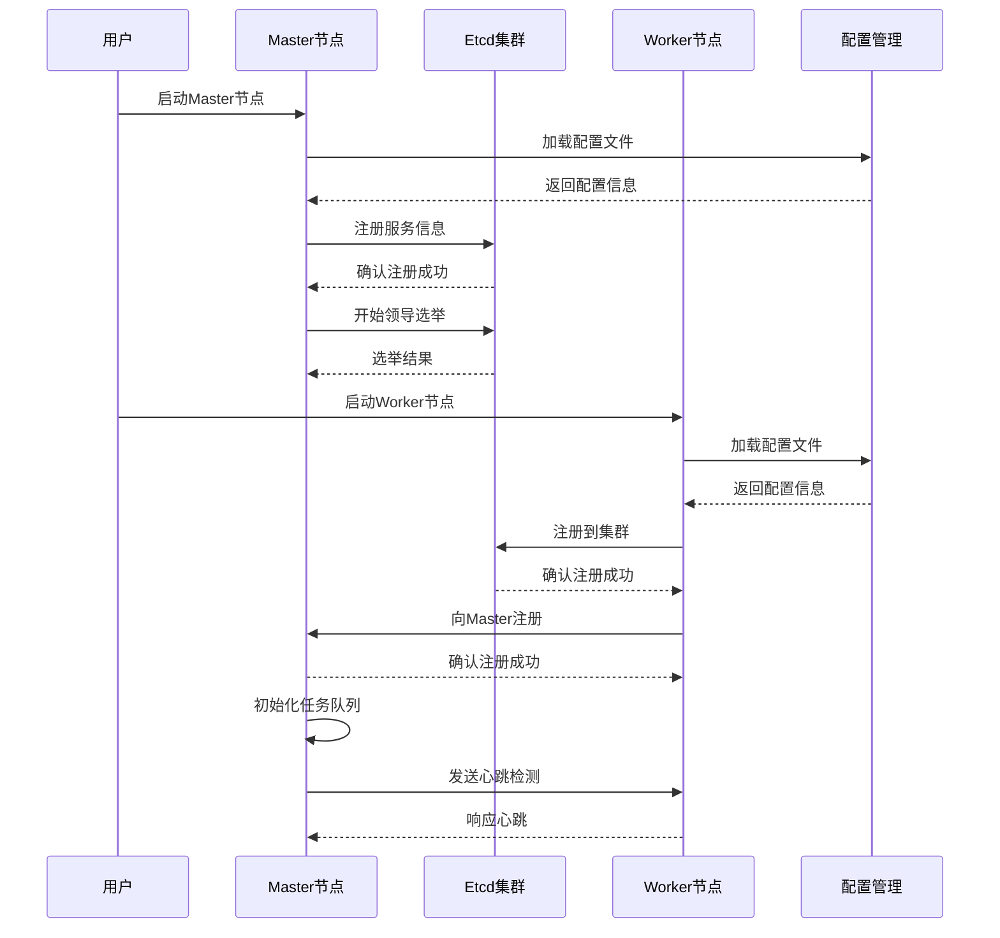
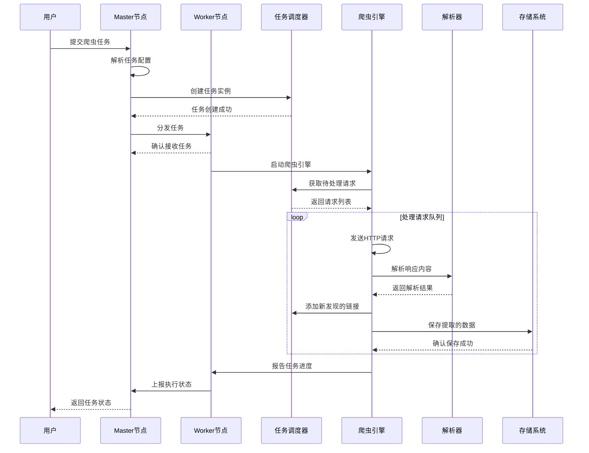
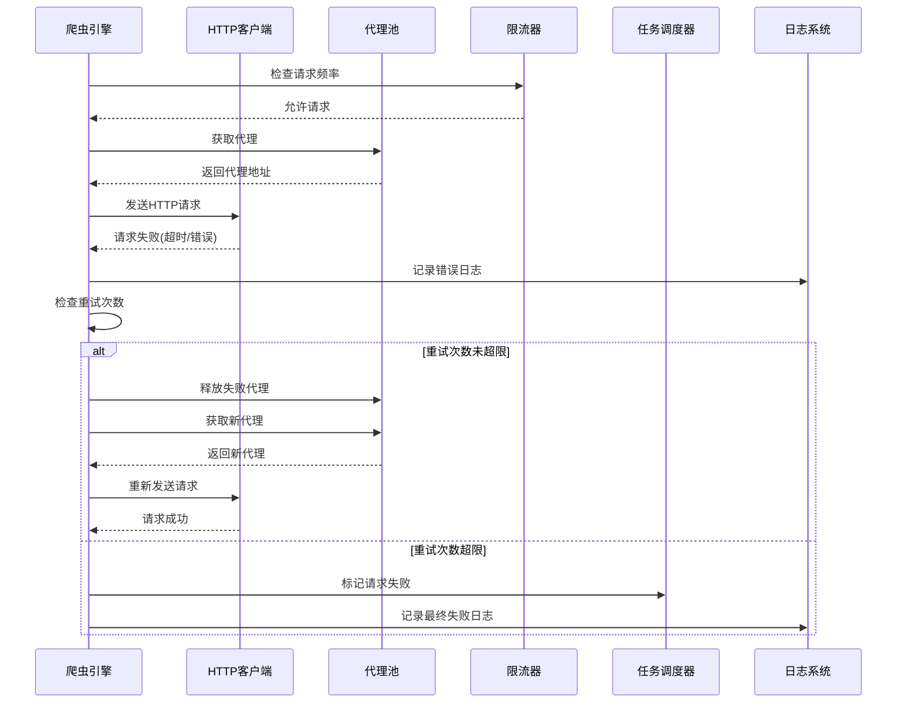
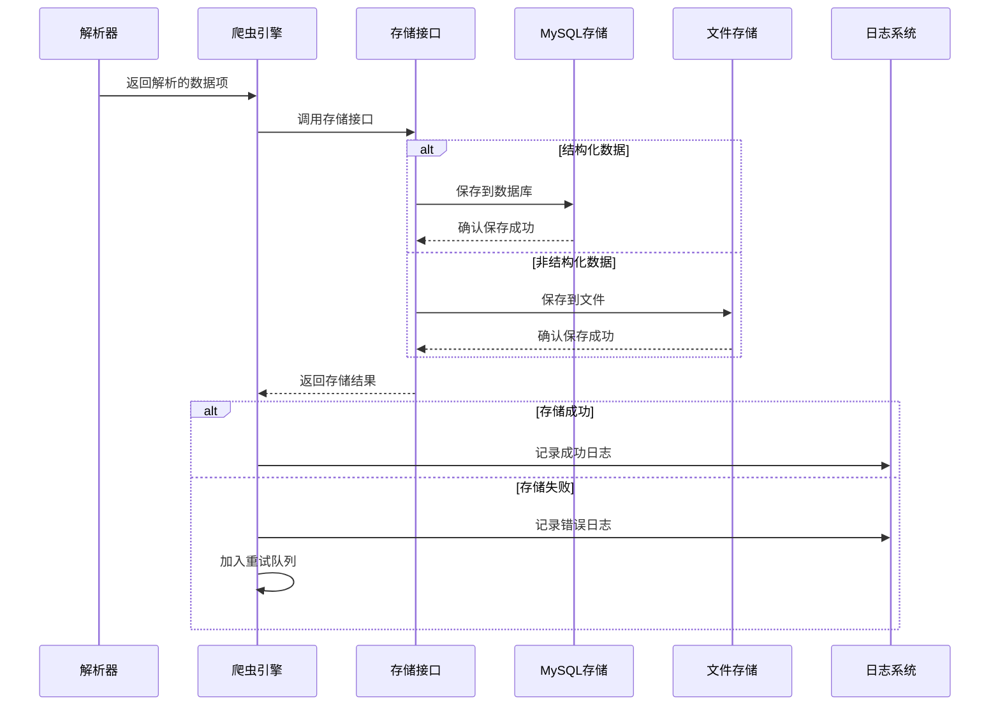
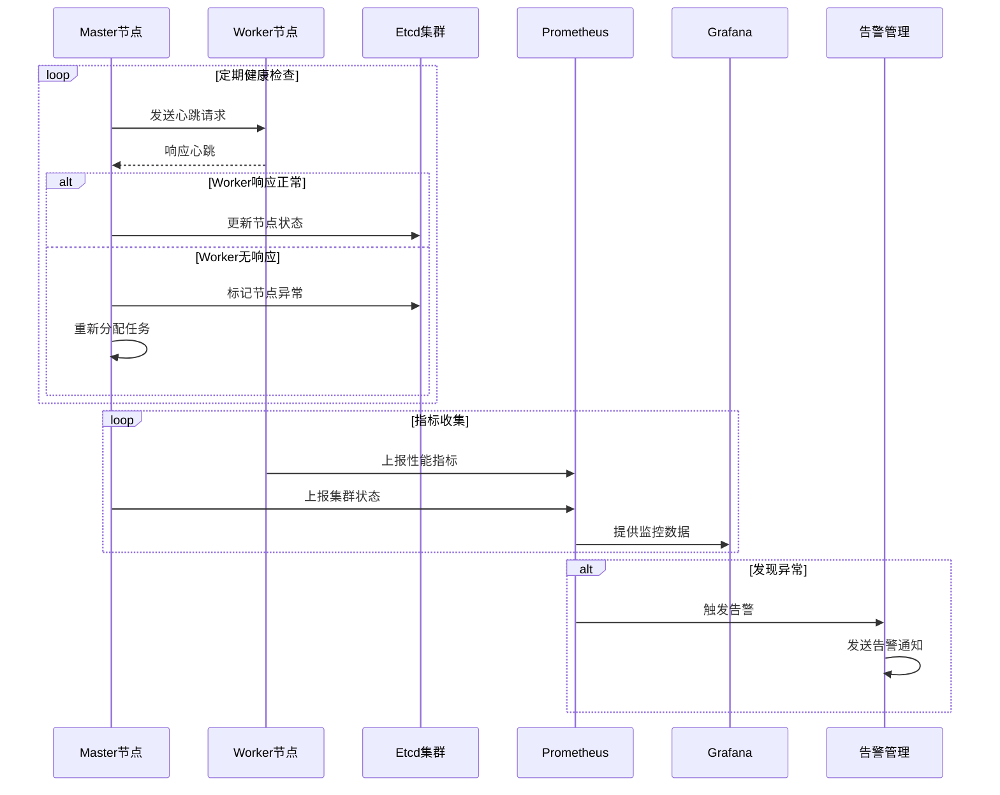
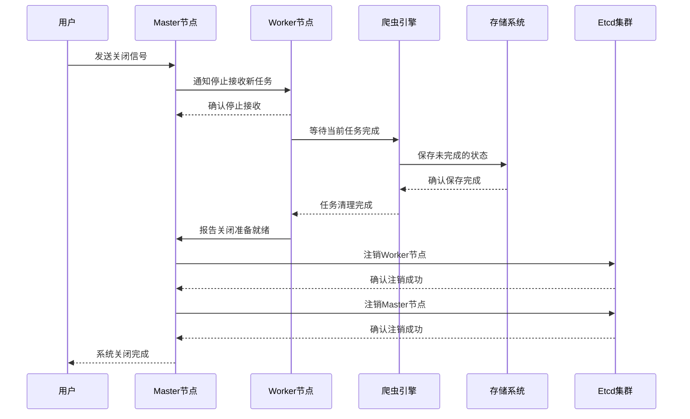

# 分布式爬虫系统 - 序列图

## 1. 系统启动流程

## 2. 任务分发与执行流程

## 3. 错误处理与重试流程

## 4. 数据存储流程

## 5. 集群监控与健康检查

## 6. 系统关闭流程

## 序列图说明

### 系统启动流程
展示了Master和Worker节点的启动过程，包括配置加载、服务注册、领导选举等关键步骤。

### 任务分发与执行流程
描述了从用户提交任务到任务执行完成的完整流程，包括任务解析、分发、执行和结果存储。

### 错误处理与重试流程
展示了系统如何处理网络错误、代理失效等异常情况，以及重试机制的工作原理。

### 数据存储流程
说明了解析后的数据如何根据类型选择不同的存储方式，以及存储失败时的处理机制。

### 集群监控与健康检查
描述了集群的健康监控机制，包括心跳检测、指标收集和异常告警。

### 系统关闭流程
展示了系统优雅关闭的过程，确保正在执行的任务能够正常完成并保存状态。