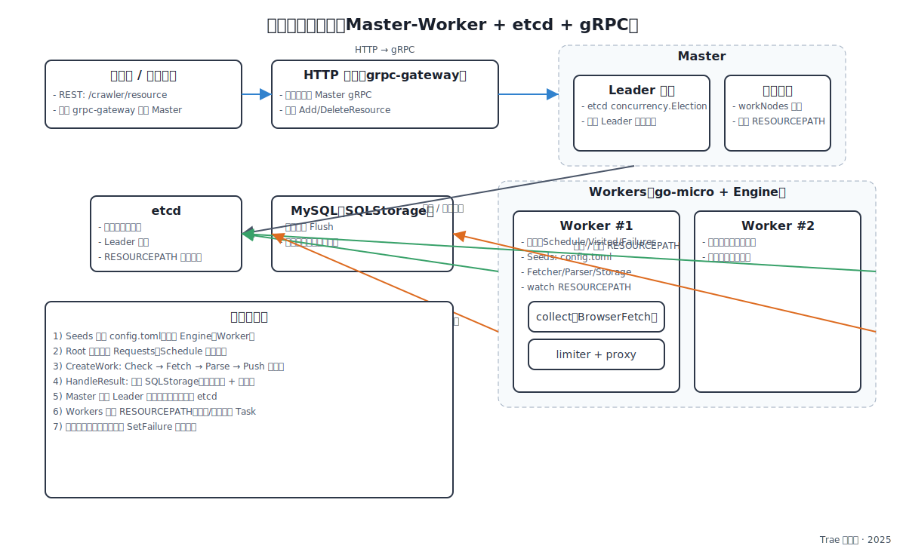

# 顶层总览（Master-Worker 分布式爬虫）

本项目是一个基于 Go 的分布式爬虫系统，采用 Master-Worker 架构，结合 etcd 进行服务发现与选举，通过 gRPC + HTTP 网关对外提供接口。你可以从整体到局部逐步掌握：先理解运行形态与数据流，再深入每个模块的职责与实现。

## 运行形态
- 进程角色：`Master` 负责集群管理与任务分配；`Worker` 负责抓取与解析。
- 服务通信：`gRPC`（go-micro）作为内部 RPC；`grpc-gateway` 暴露 REST API。
- 注册与选举：`etcd` 用于注册、资源监听与 Master 选举。
- 配置文件：`config.toml` 定义任务、抓取器、存储、端口等。

## 关键入口与命令
- `main.go`：入口，委托给 `cmd` 模块。
- `cmd/cmd.go`：注册子命令，支持 `crawler master` 与 `crawler worker`。
- `cmd/master/master.go`：Master 启动 HTTP/GRPC、加载配置、构建依赖、开启选举与服务暴露。
- `cmd/worker/worker.go`：Worker 加载配置、初始化引擎（Fetcher/Storage/Scheduler/Seeds），启动 HTTP/GRPC 服务。

## 数据流（单机与集群）
1) Seeds 注入：从 `config.toml [Tasks]` 读取并注入到引擎（`engine.NewEngine(WithSeeds)`）。
2) Root 启动：`engine.Crawler.handleSeeds` 为每个 Task 设置预置规则（`engine.Store.Hash[Name]`），执行 `Rule.Root()` 生成初始 `Requests`。
3) 调度执行：`Schedule.Pull -> Request.Fetch -> Rule.ParseFunc -> scheduler.Push(new requests)`。
4) 结果出站：解析结果通过 `c.out` 输出，`engine.HandleResult` 写入存储（默认 `storage/sqlstorage`）。
5) 集群协作：Worker 在 `engine.watchResource/loadResource` 中监听 `etcd` 的 `master.RESOURCEPATH`，根据 Master 分配的资源决定运行/关闭对应 Task。

## 分布式框架要点
- Master：`master/master.go` 维护 `workNodes/resources`，通过 `CrawlerMaster` 服务提供 `AddResource/DeleteResource`，并在选举后成为 Leader 负责任务分配。
- Worker：`engine/schedule.go` 是核心，包含请求调度、并发消费、失败重试、去重与结果处理；同时负责从 `etcd` 监听资源变化以启动/停止任务。
- Proto 与网关：`proto/crawler/crawler.proto` 定义 `CrawlerMaster` 服务，并由 `grpc-gateway` 映射到 `/crawler/resource` HTTP。

## 部署与运行
- Docker Compose：`docker-compose.yml` 定义 `master/worker/etcd/mysql`，默认端口：Worker `8080/9090`，Master `8082/9092`，etcd `2379/2380`。
- Kubernetes：`kubernetes/*.yaml` 提供示例清单，包含 Service/Deployment/Ingress。

## 快速定位（代码参考）
- 引擎与调度：`engine/schedule.go`, `engine/option.go`
- 任务与解析：`spider/*.go`, `parse/*`
- 抓取器：`collect/collect.go`
- 存储：`storage/sqlstorage/*.go`, `sqldb/*.go`
- Master：`master/master.go`, `cmd/master/master.go`
- Worker：`cmd/worker/worker.go`
- Proto：`proto/crawler/*.proto/*.go`

建议先跑通 Docker Compose，再以断点观察 `engine/schedule.go` 的 `CreateWork/HandleResult`、失败重试（`SetFailure`）与 Seeds 处理（`handleSeeds`）。