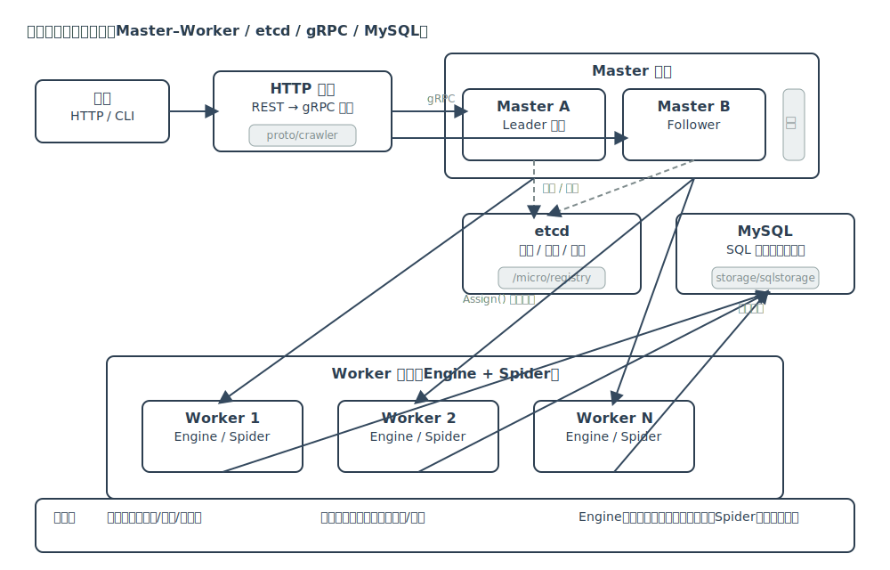

# 项目架构总览（自顶向下）

本文件从架构视角为你梳理分布式爬虫项目的整体设计与关键实现，结合你2年Go游戏服务器开发经验，采用自顶向下的方式先抓住分布式框架，再逐步落到各模块与代码细节。

## 项目定位
- 一个基于 Go 的分布式爬虫系统，以 Master–Worker 架构实现任务调度与并行抓取。
- 目标是可扩展、可容错、可观测的生产级分布式抓取平台。

## 技术栈概览
- 服务框架：`go-micro`
- 注册与选举：`etcd`
- 通信协议：`gRPC` + HTTP 网关
- 日志与观测：`zap`、`pprof`
- 数据存储：`MySQL`（SQL 存储实现，可扩展）
- 运行部署：`Docker Compose`、`Kubernetes`

## 架构总览


```
┌─────────────┐      选举      ┌─────────────┐
│   Master A  │◄─────────────►│   Master B  │
│  (Leader)   │                │ (Follower)  │
└─────┬───────┘       任务分配 └─────────────┘
      │
      ▼
┌─────────────┐                ┌─────────────┐
│   Worker 1  │  执行抓取任务  │   Worker 2  │
└─────────────┘                └─────────────┘

etcd: 服务注册、发现、选举、配置
MySQL: 抓取数据持久化
```

### 关键角色
- Master：负责 Leader 选举、资源（任务）管理、负载均衡、容错与故障转移。
- Worker：监听资源变化并执行抓取与解析，将结果写入存储。
- etcd：作为注册中心和分布式协调组件，支撑服务发现与选举。
- Storage：定义统一存储接口，默认使用 MySQL，便于替换扩展。

### 分布式特性
- 服务注册与发现：Master/Worker 使用 `go-micro` 注册到 `etcd`，客户端按需发现。
- Leader 选举：Master 借助 `etcd concurrency.Election` 参与选举，保持单点调度权。
- 负载均衡：Master 的 `Assign()` 根据 Worker 负载与资源分配策略分派任务。
- 容错与恢复：监控节点心跳，发生故障时触发任务重分配或故障转移。
- 限流与代理：`limiter` 控制速率、`proxy` 提供代理池，降低被动防护风险。
- 观测性：`zap` 统一日志，`pprof` 性能剖析，易于定位瓶颈。

## 代码结构导览

关键目录（节选）：
- `master/`：Master 节点核心逻辑（选举、资源管理、任务分配）
- `engine/`：调度引擎（队列、并发、去重、失败重试）
- `spider/`：任务、规则树、请求与解析上下文
- `parse/`：具体站点解析实现（示例：豆瓣、minimal 等）
- `storage/`：存储接口与 SQL 存储实现
- `proto/`：gRPC 协议定义与生成代码
- `cmd/`：命令行入口与 Master/Worker 启动
- `kubernetes/`、`docker-compose.yml`：部署配置

## 数据流（端到端）
1. 用户通过 HTTP/gRPC 添加任务资源（例如 `example_baidu_home`）。
2. Master 记录资源并调用 `Assign()` 将任务分派给合适 Worker。
3. Worker 的引擎 `Schedule` 监听资源，入队请求，按优先级与并发处理。
4. 引擎驱动 `Spider` 根据 `RuleTree` 执行解析，产出结构化数据。
5. 通过 `storage/sqlstorage` 写入 MySQL（或替换其他存储实现）。
6. 过程中记录日志，便于监控与问题定位。

## 配置与部署

### 配置文件（摘录）
来自 `config.toml`：
```
[app]
log_level = "info"

[fetcher]
timeout = "5s"

[mysql]
dsn = "root:123456@tcp(localhost:3306)/crawler?charset=utf8&parseTime=True&loc=Local"

[grpc]
master_addr = ":9092"
worker_addr = ":9090"

[etcd]
addr = "http://127.0.0.1:2379"
```

### 部署方式
- Docker Compose：`docker-compose.yml` 一键本地运行 MySQL、etcd、Master、Worker。
- Kubernetes：`kubernetes/` 提供 Master/Worker 的 Deployment 与 Service 示例。

## 与游戏服务器架构的对照
- Master ~ 游戏主服（匹配/调度/房间分配）；Worker ~ 房间服（具体玩法执行）。
- etcd ~ 注册中心/协调器（服务发现、主从切换、配置分发）。
- 调度引擎 ~ 游戏中的任务/消息调度器（优先级、并发、重试）。
- 规则树 ~ 游戏中的脚本/玩法规则（可扩展、可插拔）。

## 学习建议（自顶向下）
1. 先读 `cmd` 启动链路与 `master/master.go` 的选举与分配。
2. 再读 `engine/schedule.go` 的调度与并发控制；理解请求生命周期。
3. 最后落到 `spider/*` 与 `parse/*` 看规则树与解析实现，动手写一个最小任务。
4. 结合 `storage/*` 与 `kubernetes/`，完成从开发到部署的闭环。

下一步：建议阅读《01_核心模块深度解析.md》，从核心代码切入。